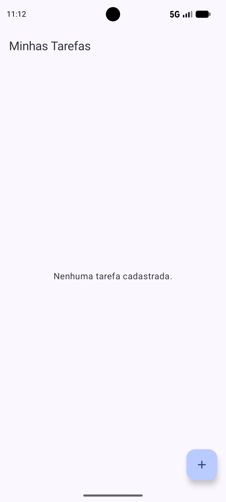
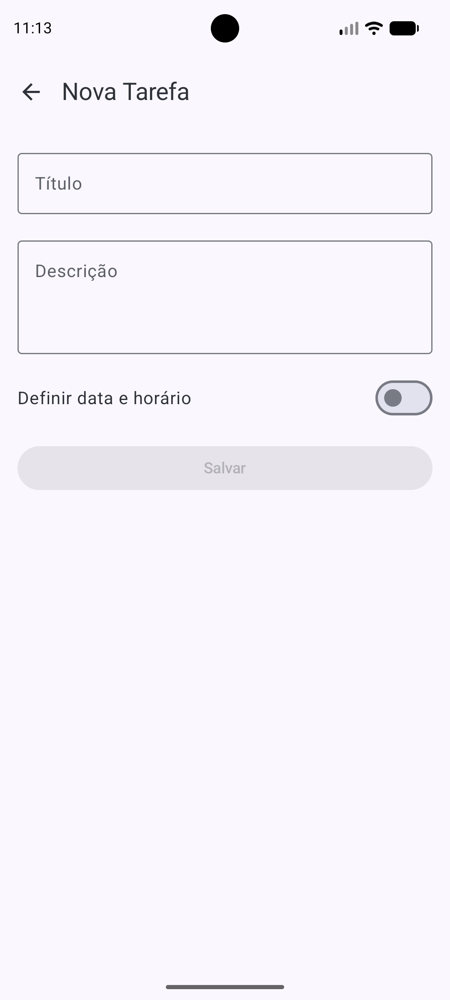
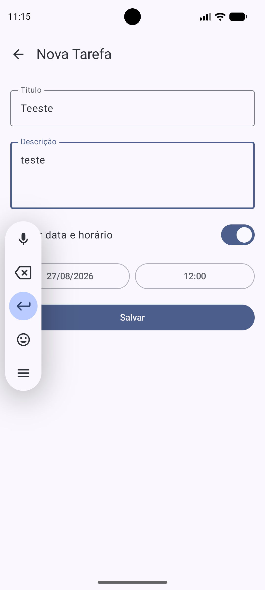
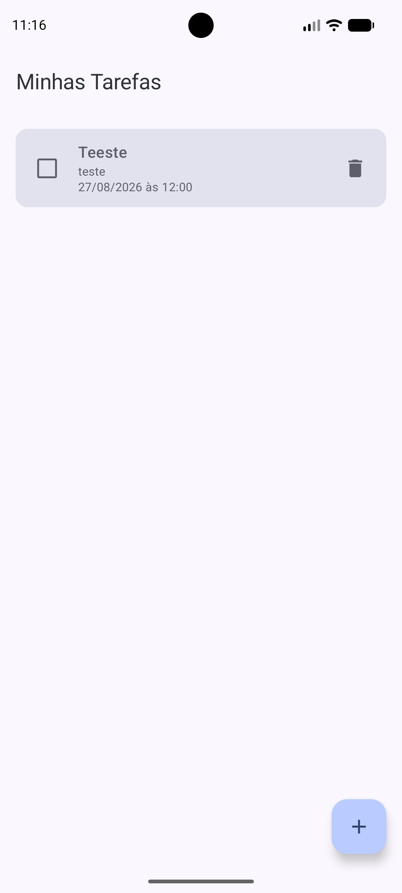
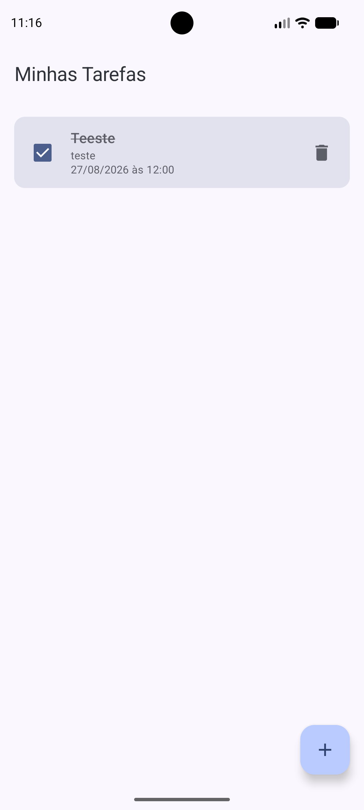
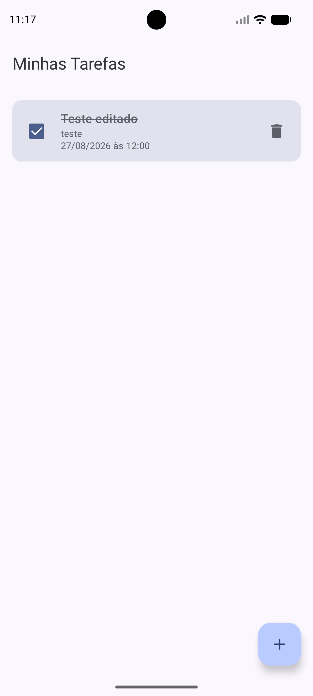
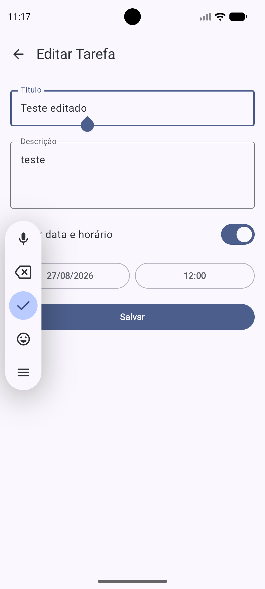
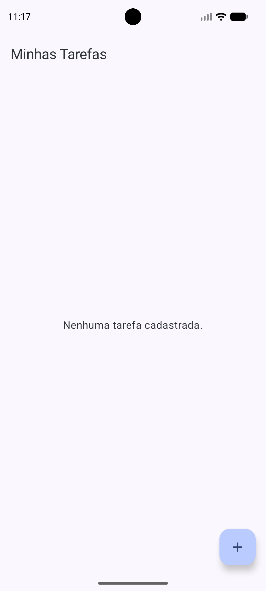

# ToDoList
Aplicativo Android de lista de tarefas desenvolvido em Kotlin com Jetpack Compose (atividade acadêmica FIAP). Permite cadastrar, listar, editar, concluir e excluir tarefas, com prazo opcional (data/hora), usando arquitetura em camadas com persistência local via Room.

## Davi Queiroz  Rm 557883


## Tecnologias

- **Kotlin** — linguagem do projeto
- **Jetpack Compose** — UI declarativa
- **Room** — persistência local (SQLite)
- **Coroutines / Flow** — assincronismo e dados reativos
- **ViewModel** — retenção de estado da UI
- **Navigation Compose** — navegação entre telas

## Arquitetura

```
UI (Compose)  →  ViewModel  →  Repository  →  DAO (Room)  →  Banco
```

**`TarefaRepository`**: abstrai o acesso aos dados. Repassa o `Flow<List<Tarefa>>` do DAO e expõe `inserir`, `atualizar` e `deletar` (funções `suspend`), isolando o ViewModel dos detalhes do Room.

**`TarefaViewModel`**: converte o `Flow` do repositório em `StateFlow` (via `stateIn`, com `WhileSubscribed(5_000)`) para a UI observar. Executa as operações de escrita dentro de `viewModelScope.launch`. Possui uma `factory(context)` que monta a cadeia `TarefaDatabase → TarefaDao → TarefaRepository → TarefaViewModel`, necessária pois o ViewModel tem construtor customizado.

**`ListaTarefasScreen`**: observa `viewModel.tarefas` com `collectAsStateWithLifecycle()`, atualizando a lista automaticamente. Dispara ações via callbacks: `onCheckedChange` chama `viewModel.atualizar(...)`, o botão de lixeira chama `viewModel.deletar(...)`, e o FAB/clique no item disparam a navegação para o formulário (criação ou edição).

**`FormularioTarefaScreen`**: recebe `tarefaId`. Se `id == 0`, é uma tarefa nova (campos vazios); caso contrário, busca a tarefa existente e pré-preenche o formulário. Ao salvar, chama `viewModel.inserir(...)` quando `tarefaId == 0`, ou `viewModel.atualizar(...)` preservando o `id` original.

**`AppNavigation`**: define as rotas `"lista"` e `"formulario/{tarefaId}"`. Novas tarefas navegam para `"formulario/0"`; edição navega para `"formulario/$id"`. O ID é lido dos argumentos da rota e repassado ao formulário, que o usa para decidir entre cadastro e edição.

**`MainActivity`**: cria o `TarefaViewModel` com `viewModel(factory = TarefaViewModel.factory(applicationContext))` e inicia `AppNavigation(viewModel = viewModel)`, compartilhando a mesma instância entre as telas.

## Como executar

1. Abra o projeto no Android Studio (JDK 21).
2. Sincronize o Gradle.
3. Selecione um emulador/dispositivo (API 24+) e clique em **Run**, ou rode:
   ```
   ./gradlew installDebug
   ```

Testes:
```
./gradlew test
./gradlew connectedAndroidTest
```

## Tela inicial


## Nova tarefa


## Adicionando tarefa


## Tela criada


## Tarefa Check


## Tarefa Editada


## Editando tarefa


## Tarefa Apagada


